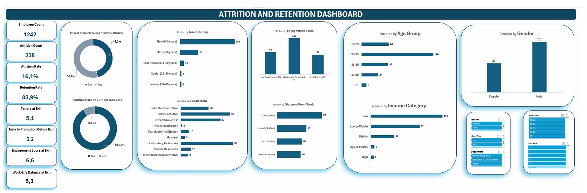
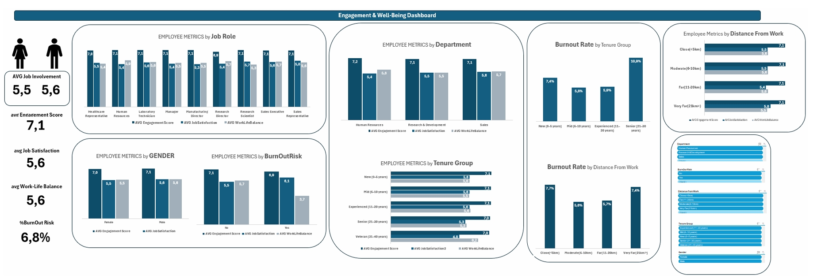
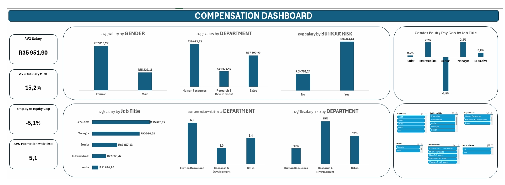

# 🧠 HR Analytics Dashboard: Attrition, Engagement & Compensation

## Project Overview

This project goes deeper than a standard HR dashboard. Using **Excel and Power Query**, I built three interconnected dashboards — covering attrition, employee engagement/well-being, and compensation — and then synthesised findings across all three to surface insights that no single dashboard could reveal on its own.

The dataset was adapted for local relevance: salary figures were **converted from USD to ZAR** at an approximated market rate, making the compensation analysis meaningful in a South African context.

---

## Data Preparation

All transformations were done in **Power Query (Excel)**:

| Transformation | Purpose |
|----------------|---------|
| Removed duplicates & handled missing values | Data integrity |
| Converted Job Satisfaction to /10 scale | Aligned with Engagement Score for direct comparison |
| Grouped commute distance into bands (short / medium / long) | Simplified pattern analysis |
| Created salary bands (income categories) | Easier compensation comparisons |
| Converted salary from USD → ZAR | Local market context |
| Grouped tenure into ranges (0–1, 2–5, 6–10, 10+ years) | Retention pattern analysis by career stage |

---

## Key Metrics

| Metric | Value |
|--------|-------|
| Total Workforce | 1,242 employees |
| Attrition Rate | 16.1% |
| Retention Rate | 83.9% |
| Avg. Tenure at Exit | 5.1 years |
| Avg. Engagement Score | 7.1 / 10 |
| Avg. Job Satisfaction | 5.6 / 10 |
| Avg. Work-Life Balance at Exit | 5.3 / 10 |
| Avg. Salary | R35,951.90 |

---

## Dashboard 1: Attrition Analysis

### Key Findings
- Attrition is highest among **employees aged 18–35 (160 exits)**, concentrated in the 0–5 and 6–10 year tenure bands — meaning the company is losing people before they fully mature in their roles.
- The roles with the most exits are **Sales Executive (58)** and **Laboratory Technician (62)**.
- **53.8% of leavers worked overtime**, yet 91.4% were not classified as burnout risks — overtime alone isn't the primary driver.
- Male attrition (151) is notably higher than female (87).

### Standout Insight
The **average promotion wait time for employees who left was 3.2 years**. For new and mid-career professionals, waiting over three years without progression is a clear push factor — and likely the most actionable lever for improving retention.

---

## Dashboard 2: Engagement & Well-being

### Key Findings
- There is a **meaningful gap between Engagement (7.1) and Job Satisfaction (5.6)** — employees are active and contributing, but not fulfilled in their roles.
- The **HR department** reports the lowest scores across all three metrics: engagement, satisfaction, and work-life balance.
- The **Sales department** is high-engagement but low-satisfaction — a warning sign for imminent burnout and departures.
- **Senior employees (21–30 years tenure)** face the highest burnout risk at 10.9%.

### Standout Insight
Burnout risk is elevated for employees with **very short (<5km) and very long (>21km) commutes** — 7.7% and 7.4% respectively. This non-linear pattern suggests commute stress isn't just about distance, and points to flexible or hybrid work arrangements as a targeted intervention.

---

## Dashboard 3: Compensation Analysis

### Key Findings
- Average salary hike is **15.2%**, with Sales receiving the highest hikes at 15%.
- Salary scales as expected with seniority: Junior (R12,856) → Executive (R115,103).
- **Employees with high burnout risk earn more on average (R38,304)** than lower-risk employees — higher pay correlates with higher pressure in this dataset.
- Female employees earn a higher average salary (R37,910) vs males (R35,229), resulting in a **-5.1% equity gap favouring women** — unusual and worth monitoring across roles and tenure levels for full context.

---

## Synthesised Insights Across All Three Dashboards

This is where the analysis becomes more than the sum of its parts:

- **Pay alone isn't retaining people.** Sales has the highest salary hikes *and* the highest attrition — which means raises are not addressing the underlying dissatisfaction.
- **The satisfaction-engagement gap is the core problem.** Employees are engaged enough to perform, but not satisfied enough to stay. This gap is most critical in Sales and Research.
- **Slow promotions + low satisfaction = mid-career exits.** The 3.2-year average promotion wait directly maps to the 2–5 and 6–10 year tenure groups that show the highest attrition.
- **Work-life balance (5.3 at exit) is a leading indicator of turnover** — and the commute burnout data suggests hybrid work would have a measurable impact on retention.

---

## Recommendations

1. **Accelerate promotion cycles** for high performers in the 2–5 year tenure band
2. **Investigate HR department** — the lowest scores across all metrics in the people team itself is a structural concern
3. **Introduce hybrid work options** to address both commute-linked burnout and work-life balance at exit
4. **Audit Sales compensation strategy** — high hikes + high attrition suggests money isn't the issue; culture and workload are

---

## Tools Used

- **Microsoft Excel** — dashboard development, charts, and KPI cards
- **Power Query** — data cleaning, transformation, and feature engineering
